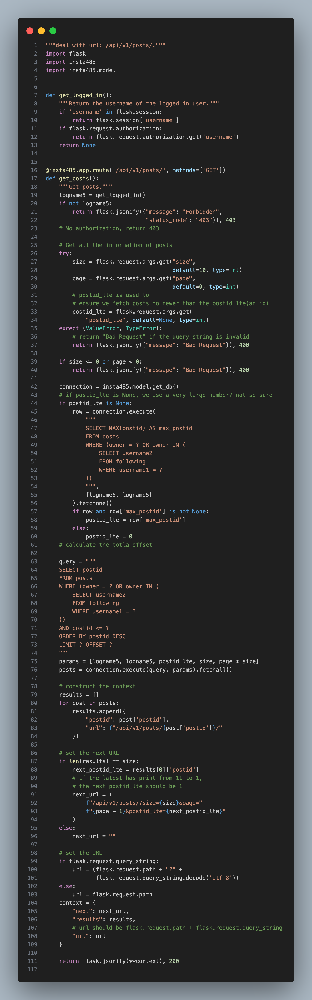
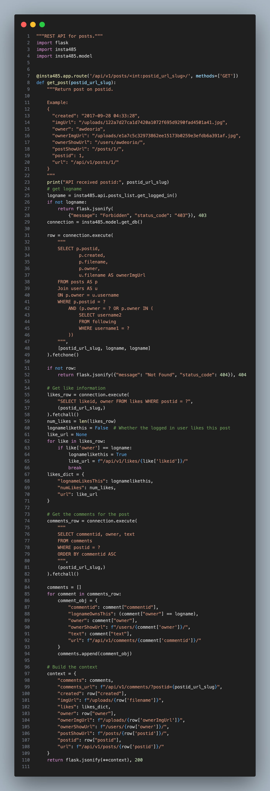
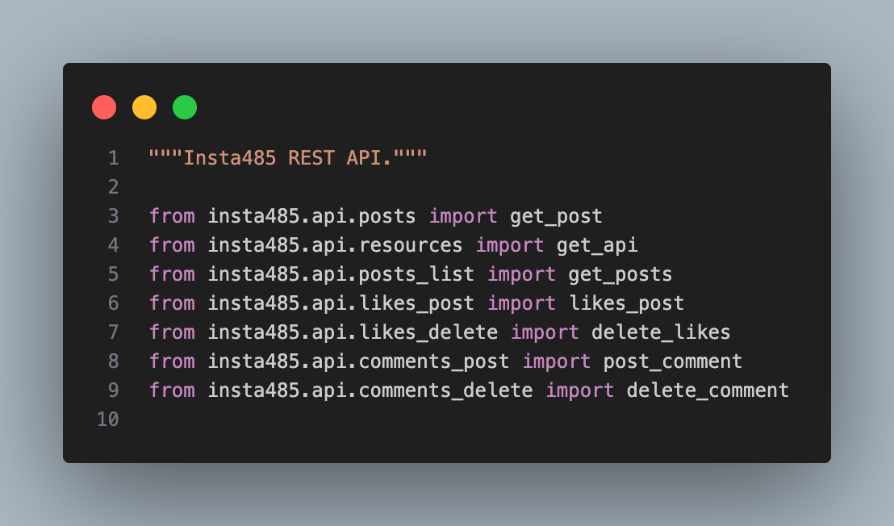
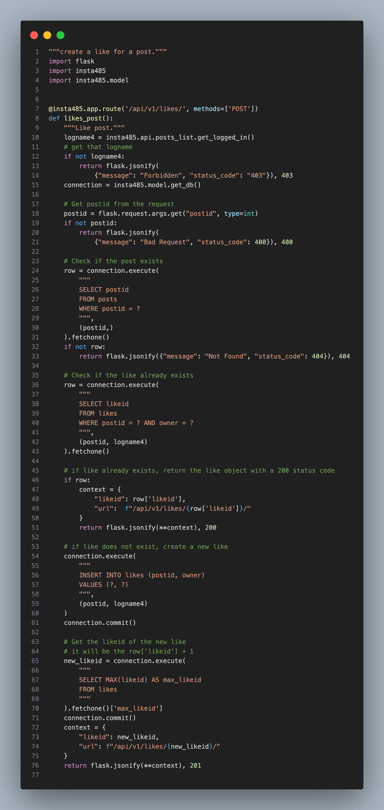
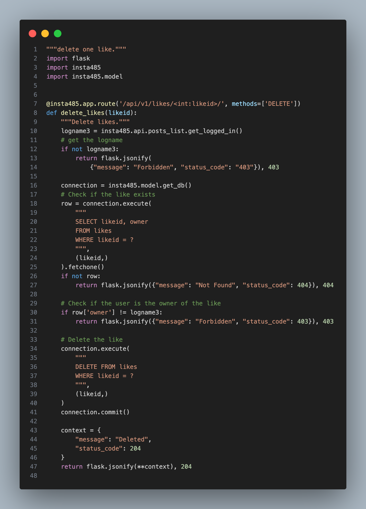
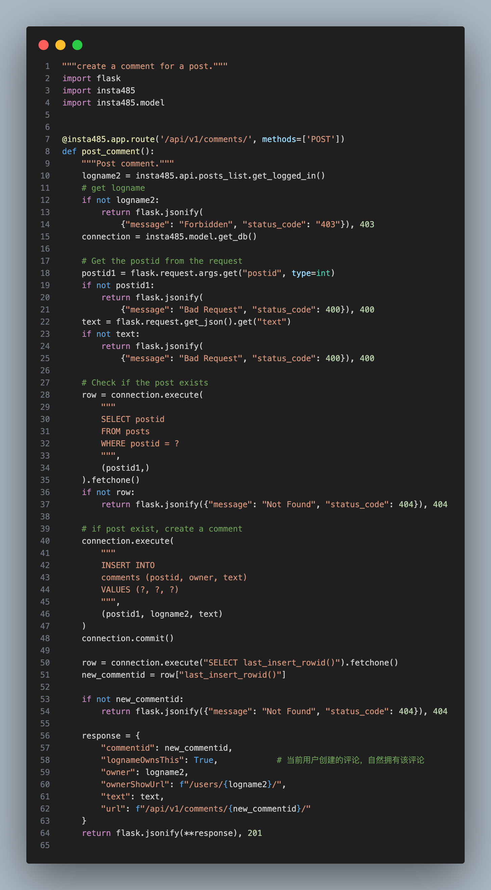
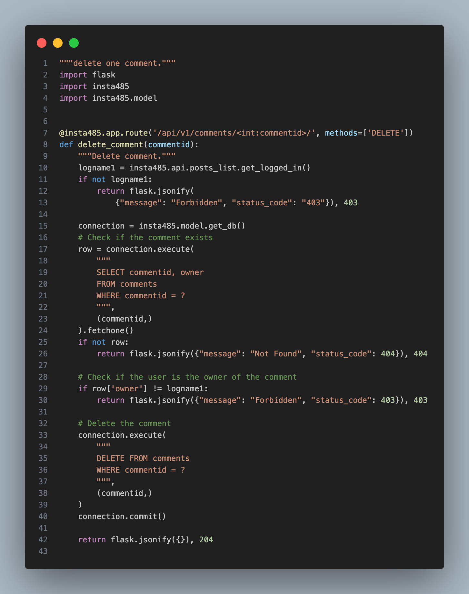
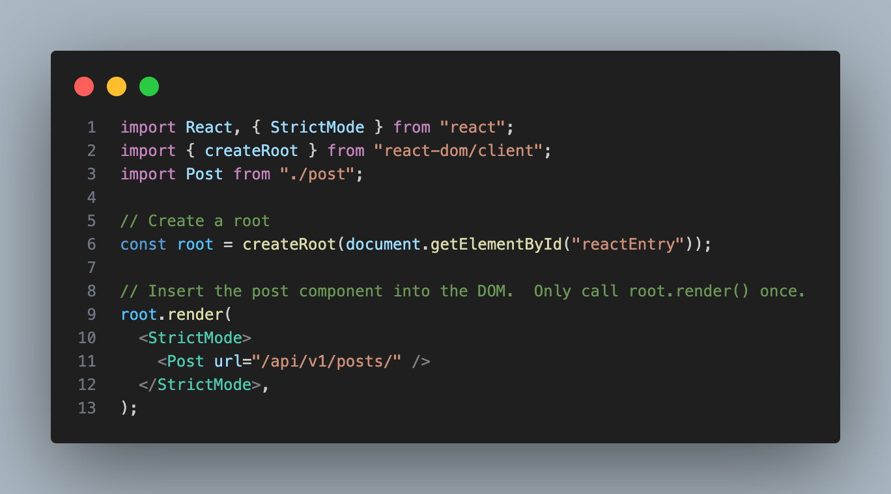

# Instagram Clone - Full Stack

A full-stack Instagram clone built with React (frontend) and Flask (backend), featuring real-time interactions like likes, comments, and infinite scroll.

## Overview

This project demonstrates modern web development practices with a focus on:
- **Frontend**: React component architecture with dynamic state management
- **Backend**: Flask RESTful API with database integration
- **Testing**: Comprehensive end-to-end testing with Cypress
- **Code Quality**: ESLint, Prettier, and Python linting

## Features

- **User Authentication**: Login/logout and account management
- **Posts**: Create, view, edit, and delete posts with image uploads
- **Interactions**: Like and comment on posts in real-time
- **Social Features**: Follow/unfollow users, view follower/following lists
- **Infinite Scroll**: Lazy-loaded feed for better performance
- **REST API**: Complete REST API for all operations

## Tech Stack

### Frontend
- **React 18** - UI library
- **Webpack** - Module bundler
- **Babel** - JavaScript transpiler
- **ESLint & Prettier** - Code quality & formatting
- **Cypress** - End-to-end testing

**Node.js**: >= 22.0.0  
**Package Manager**: npm

### Backend
- **Flask** - Web framework
- **SQLite** - Database (via schema.sql)
- **Python** - >= 3.12

**Dependencies**: Arrow, BeautifulSoup4, Markdown, pytest, requests, and more

## Project Structure

```
app/
├── api/                    # REST API endpoints
├── js/                     # React components and main.jsx
├── static/                 # Static assets (CSS, images)
│   ├── css/
│   └── images/
├── templates/              # HTML templates
├── views/                  # Flask view handlers
├── config.py               # Configuration
├── model.py                # Database models
└── __init__.py             # Flask app initialization

sql/
├── schema.sql              # Database schema
└── data.sql                # Sample data

tests/
├── cypress/                # End-to-end tests
├── test_*.py               # Python unit tests
└── conftest.py             # Pytest configuration

docs/
├── images/                 # Documentation images & architecture diagrams
└── ...                     # Additional documentation

Config Files:
├── package.json            # Frontend dependencies
├── pyproject.toml          # Backend project config
├── requirements.txt        # Python dependencies
├── tsconfig.json           # TypeScript configuration
├── webpack.config.js       # Webpack build config
├── cypress.config.js       # Cypress configuration
└── .eslintrc               # Linting rules
```

## Documentation & Screenshots

All documentation images and diagrams are located in [`docs/images/`](docs/images/).

### API Architecture Diagrams

<div align="center">

**Posts API**  


**Posts List API**  


**Resources Overview**  


**API Initialization**  


</div>

### Likes & Comments API

<div align="center">

**Post Like Endpoint**  


**Delete Like Endpoint**  


**Comment Endpoint**  


**Delete Comment Endpoint**  


</div>

### Component Architecture

<div align="center">

**Main Component Structure**  


**Post Component**  


</div>

### Assets

<div align="center">

**Application Logo**  


</div>

### Test Fixtures

<div align="center">

**Sample Upload 1**  


**Sample Upload 2**  


</div>

## Development Workflow

1. **Frontend Development**: Modify React components in `app/js/`
2. **Backend Development**: Update Flask views in `app/views/`
3. **Testing**: Run Cypress tests for E2E validation and Python tests for unit testing
4. **Building**: Use `npm run build` to bundle frontend code with Webpack

## Scripts

```bash
npm run build          # Build frontend with Webpack
npm run start          # Start development server
npm run test           # Run Cypress tests
npm run cypress:open   # Open Cypress Test Runner
npm run lint           # Run ESLint
npm run format         # Format code with Prettier
```

## License

MIT

---

Built with ❤️ by a dedicated development team.
